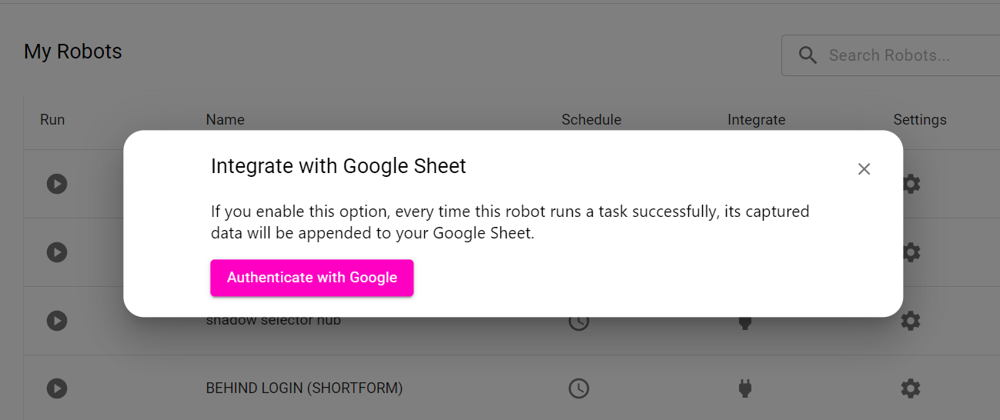
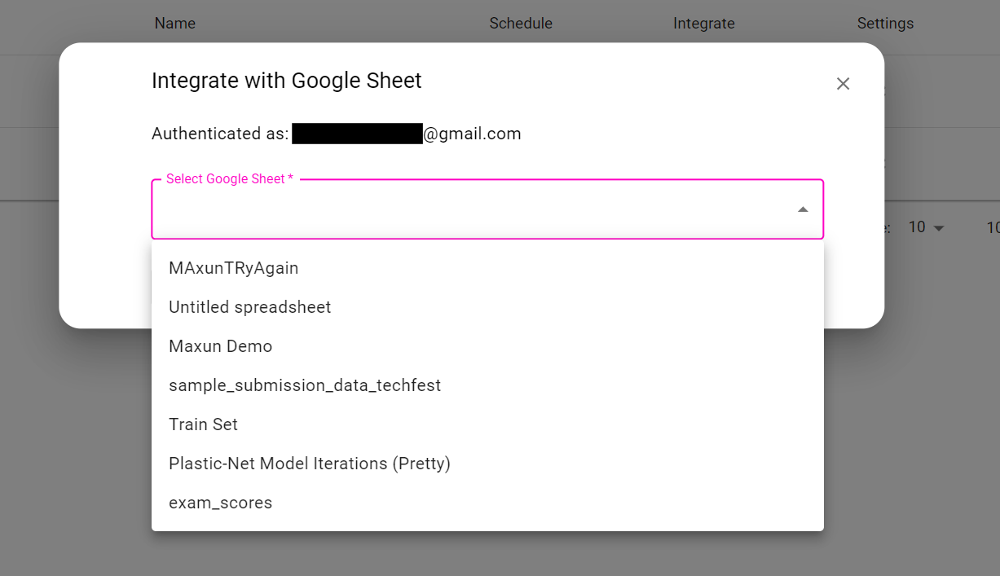
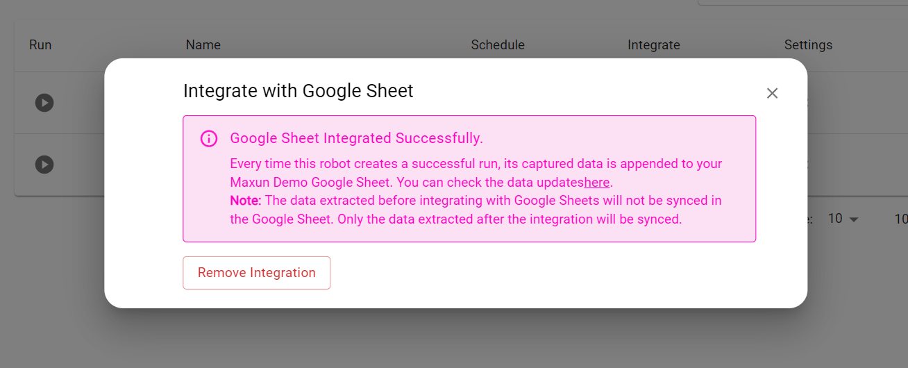

# Google Sheet

## Overview

Google Sheets integration allows you to automatically sync the data extracted by your robot directly into a Google Sheet. Whenever the robot completes a successful run, the captured data is appended to your designated Google Sheet, enabling seamless and real-time data management.

## Key Features

1. Automatic Data Syncing: Every successful robot run appends the captured data directly to your Google Sheet.
2. Effortless Data Management: Keep all your extracted data organized in a single Google Sheet for easy access and sharing.
3. Real-Time Updates: As soon as a run is complete, the data appears in your Google Sheet.

## Important Note

The data extracted before integrating with Google Sheets will not be synced in the Google Sheet. Only the data extracted after the integration will be synced.

## Setting Up Google Sheets Integration

### Maxun Cloud
Coming soon...

### Maxun Open Source

#### 1. Bring Your Own Google OAuth Keys
Obtain Google OAuth keys by setting up a project in the [Google Cloud Console](https://console.cloud.google.com/).
Ensure the necessary API permissions (Google Sheets and Google Drive APIs) are enabled for the project.

#### 2. Authenticate With Google
Set up the OAuth Keys in the `.env` file and authenticate the robot with google **using the same account that was used to create the Client ID and Client Secret**.

#### 3. Select Spread Sheet From Google Drive
On successful authentication with google, the robot will be granted access to Google Drive. A spreadsheet can be selected from the Drive to store data from the run.

After selecting the Google Sheet, the robot will automatically append data to it after each successful run. If needed, the user can remove the integration at any time.

## Demo Tutorial
<iframe width="560" height="315" src="https://www.youtube.com/embed/3EF66DsIze8?si=wuYdtpAhypDLELXU" title="YouTube video player" frameborder="0" allow="accelerometer; autoplay; clipboard-write; encrypted-media; gyroscope; picture-in-picture; web-share" referrerpolicy="strict-origin-when-cross-origin" allowfullscreen></iframe>
