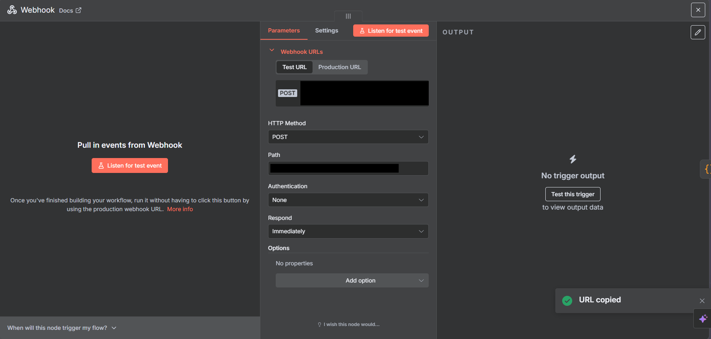
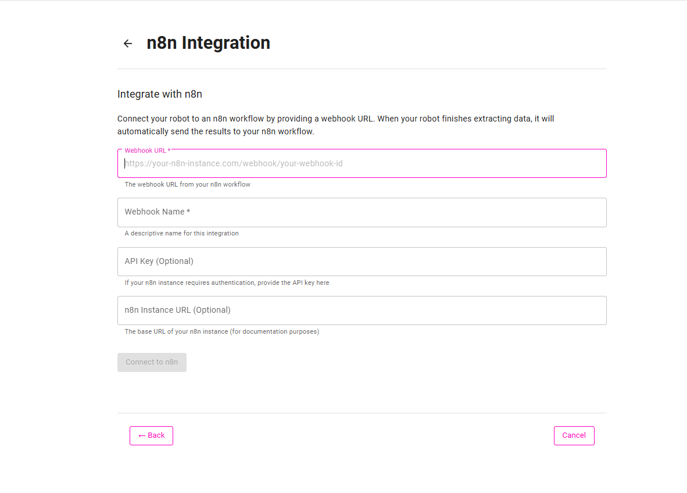
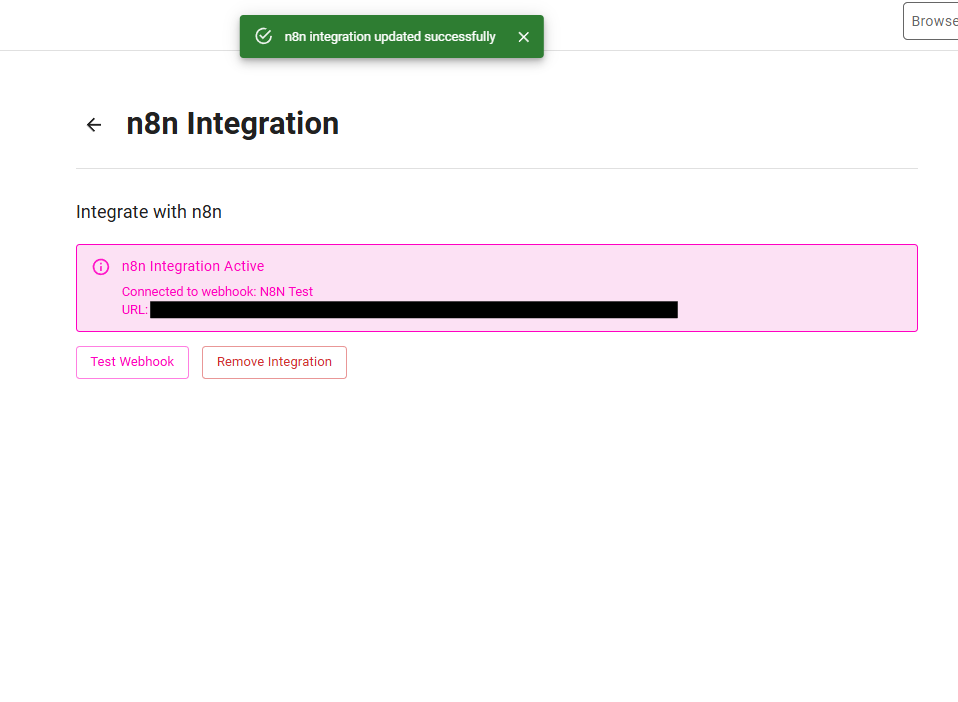
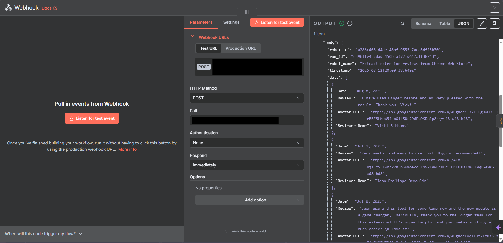

# n8n

## Overview

n8n integration allows you to automatically send the data extracted by your robot directly to your n8n workflow via webhook. Whenever the robot completes a successful run, the captured data is sent as a POST request to your configured n8n webhook endpoint, enabling seamless automation and data processing within your n8n workflows.

## Key Features

1. Automatic Data Sending: Every successful robot run sends the captured data directly to your n8n webhook endpoint.
2. Real-Time Workflow Triggers: As soon as a run is complete, your n8n workflow is triggered with the fresh data.
3. Flexible Data Processing: Use n8n's powerful workflow capabilities to process, transform, and route your extracted data.

## Important Note

The data extracted before integrating with n8n will not be sent to your workflow. Only the data extracted after the integration will be sent to your n8n webhook.

## Setting Up n8n Integration

### Step 1: Configure Webhook in n8n
Create a webhook trigger node in your n8n workflow and copy the webhook URL.



### Step 2: Set Up Integration in Maxun


Configure the webhook endpoint in your robot integration settings with the following fields:

#### Required Fields:
- **Webhook URL**: The n8n webhook endpoint URL (obtained from Step 1)
- **Webhook Name**: A descriptive name for this webhook integration

#### Optional Fields:
- **API Key**: Optional authentication key for additional security
- **n8n Instance URL**: Your n8n instance URL (if using a custom/self-hosted instance)



### Step 3: Test the Integration
Run your robot to test the webhook integration or use the Test Webhook button. The extracted data will be sent to your n8n workflow.

<!--  -->

## Data Format

When your robot sends data to n8n, it will be structured as follows:

```json
[
  {
    "headers": {
      "user-agent": "axios/0.26.1",
      "content-type": "application/json",
      "accept": "application/json, text/plain, */*"
    },
    "params": {},
    "query": {},
    "body": {
      "robot_id": "a286c468-d4de-48bf-9555-7aca3df23b30",
      "run_id": "488f4109-fa61-4222-b72c-74e00b17c142",
      "robot_name": "Your Robot Name",
      "timestamp": "2025-08-12T19:46:52.025Z",
      "data": [
        {
          "Field1": "Extracted Value 1",
          "Field2": "Extracted Value 2",
          "Field3": "Extracted Value 3"
        }
      ],
      "metadata": {
        "total_records": 10,
        "data_types": {
          "schema_records": 0,
          "list_records": 10,
          "screenshot_records": 0
        }
      }
    },
    "webhookUrl": "https://your-n8n-instance.com/webhook/your-webhook-id",
    "executionMode": "production"
  }
]
```

## Key Data Fields

- **robot_id**: Unique identifier for the robot
- **run_id**: Unique identifier for this specific run
- **robot_name**: The name of your robot
- **timestamp**: When the data was extracted
- **data**: Array containing all extracted records
- **metadata**: Information about the extraction results

## Demo Tutorial
<iframe width="560" height="315" src="https://www.youtube.com/embed/0o2xMOa8Ee8?si=lnZE-Idky-X46hd-" title="YouTube video player" frameborder="0" allow="accelerometer; autoplay; clipboard-write; encrypted-media; gyroscope; picture-in-picture; web-share" referrerpolicy="strict-origin-when-cross-origin" allowfullscreen></iframe>